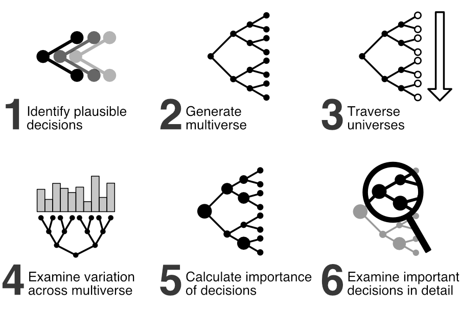

# One Model Many Scores

## An Interactive Analysis of the Machine Learning Multiverse

This document is an interactive companion article illustrating a subset of the results from the paper "[One Model Many Scores: Preventing Fairness Hacking and Evaluating the Influence of Model Design Decisions](https://arxiv.org/abs/2308.16681)" by Jan Simson, Florian Pfisterer and Christoph Kern to be presented at the *ACM Conference on Fairness, Accountability, and Transparency 2024* in Rio de Janeiro, Brazil in June 2024.

A preprint of the paper is available at [arxiv.org/abs/2308.16681](https://arxiv.org/abs/2308.16681), the source code of the analyses as well as this interactive document is available at [github.com/reliable-ai/fairml-multiverse](https://github.com/reliable-ai/fairml-multiverse).

<div class="grid grid-cols-2">

<div>

# Introduction

We try to keep the introduction here short and refer to the [paper](https://arxiv.org/abs/2308.16681) for a proper introduction into the topic and case study used to generate the present results.

The basic idea of a multiverse analysis is to *turn implicit decisions into explicit ones*, traversing the garden of forking paths one encounters when conducting an analysis or building a machine learning system.

By systematically combining many decision options, we can evaluate the influence of these decisions on a certain outcome, in our case the performance and fairness of a machine learning model.

For this analysis we combined 9 potential design decisions and 3 evaluation decisions (see [Table 1](https://arxiv.org/html/2308.16681v2#S2.T1) in the full paper for an overview). By combining these decisions we generate a multiverse with 61440 different system designs / models and 28 evaluation strategies per model. Altogether, this results in **1,720,320 universes 🪐** of how a person may design and evaluate this particular system.

Please note, that just because we included certain decisions or settings in our analysis it does not mean we condone them. On the contrary, we strongly advice against applying some of these practices and only include them to raise awareness of their potential harm (see [Section 2.2.1](https://arxiv.org/html/2308.16681v2#S2.SS2.SSS1)).

</div>

<div>

<figure>



<figcaption>
  The steps to conduct a multiverse analysis for algorithmic fairness.
  Steps 1 - 4 apply to multiverse analyses in general, whereas steps 5 - 6 are a new addition for multiverse analyses for algorithmic fairness.
</figcaption>

</figure>

</div>

</div>


# Model Design

We split our analysis into two parts: decisions of model design and different evaluation strategies. In this first section we will look at the influence of different model design decisions on the performance and fairness of the resulting machine learning models using a default evaluation strategy.

You can first select which metrics you want to focus on. Pick a fairness metric ([Equalized Odds Difference](https://fairlearn.org/main/api_reference/generated/fairlearn.metrics.equalized_odds_difference.html) or [Demographic Parity Difference](https://fairlearn.org/main/api_reference/generated/fairlearn.metrics.demographic_parity_difference.html)) and a performance metric ([F1 Score](https://scikit-learn.org/stable/modules/generated/sklearn.metrics.f1_score.html), [Accuracy](https://scikit-learn.org/stable/modules/generated/sklearn.metrics.accuracy_score.html) or [Balanced Accuracy](https://scikit-learn.org/stable/modules/generated/sklearn.metrics.balanced_accuracy_score.html)) from the dropdowns below.

```js
const colsFairness = [
  "eq_odd_diff",
  "dem_par_diff",
]

const colsPerformance = [
  "accuracy",
  "balanced_accuracy",
  "f1",
]

const colsScores = [
  ...colsFairness,
  ...colsPerformance,
]

const colsModelSettings = [
  "s_cutoff",
  "s_encode_categorical",
  "s_exclude_features",
  "s_exclude_subgroups",
  "s_model",
  "s_preprocess_age",
  "s_preprocess_income",
  "s_scale",
  "s_stratify_split"
]

const colsEvalSettings = [
  "s_eval_fairness_grouping",
  "s_eval_exclude_subgroups",
  "s_eval_on_subset",
]
```

```js
import { vgplot } from "./components/mosaic.js";
const multiverse = await FileAttachment("data/df_agg_prepared.parquet").url();
const vg = vgplot(vg => [
  vg.loadParquet("multiverse", multiverse, {}),
  // Prefilter full multiverse data to correspond to Study 1
  `CREATE TABLE study1
    AS (
      SELECT * FROM multiverse
      WHERE s_eval_fairness_grouping = 'race-all'
        AND s_eval_exclude_subgroups = 'keep-in-eval'
        AND s_eval_on_subset = 'full'
    )
  `
]);
```

```js
const $range = vg.Selection.intersect();
window.range = $range;
```

```js
const detailValue = Mutable(null);
const updateDetailValue = (value) => {
  detailValue.value = value;
}
```

```js
const $detail = vg.Selection.intersect();

function makeTableSelectable(table, options) {
  const { as, filterColumns, onUpdate } = options;

  table.addEventListener("click", (e) => {
    const row = e.target.closest("tr");
    const header = e.target.closest("th")
    if (header || !row) return;

    // Get column names and row values
    // Note: This is a pretty dirty way of doing this and most likely
    // only works for columns of type string
    const columns = table.value.data.schema.fields.map((x) => x.name);
    const values = Array.from(row.children).map(cell => cell.textContent);

    // Create an object from the two
    const entry = {};
    columns.forEach((column, i) => {
      entry[column] = values[i];
    });
    console.log("[selectable-table] Clicked Entry", entry)

    // Generate individual clauses and combine them to one
    if (filterColumns === undefined) {
      filterColumns = columns;
    }
    const clauses = []
    const finalValue = {}
    filterColumns.forEach(column => {
      // Add clause
      clauses.push(vg.eq(column, vg.literal(entry[column])));
      // Construct final value
      finalValue[column] = entry[column];
    });
    const predicate = vg.and(...clauses)

    // Update selection
    as.update({
      source: table,
      schema: { type: 'point' },
      value: finalValue,
      predicate,
    });

    // Allow custom callback function
    if (onUpdate) {
      onUpdate(finalValue);
    }

    // Add class to selected row for highlighting
    document
      .querySelectorAll("tr.selected")
      .forEach(r => r.classList.remove("selected"));
    row.classList.add("selected");
  })

  table.classList.add("selectable-table");

  console.log("[selectable-table] Initialized", table)
  return table
}
```

<style>
  /* Overall Styles */
  /* Floating Table headers */
  thead tr th {
    position:sticky;
    top:0;
    background:#fff;
    cursor:ns-resize;
    border-bottom: solid 1px #ccc;
  }
  /* Remove table margin */
  table {
    margin: 0;
  }

  /* Custom Table Selector */
  .selectable-table .selected {
    background-color: #f0f0f0;
  }
  .selectable-table tbody tr {
    cursor: pointer;
  }
  .selectable-table tbody tr:hover {
    background-color: #ddd;
  }
</style>

<div class="tip"> This interactive analysis is powered by recently released and in-development software, which means that it can sometimes be a bit unstable. We therefore recommend to only modify these two dropdowns before interacting with the plots below. In case of issues please <a href="#model-design" onclick="window.location.reload()">🔄 refresh</a> this site. </div>

```js
// This currently only supports a handful of value changes before breaking
const colFairness = view(
  Inputs.select(
    colsFairness,
    {value: "eq_odd_diff", label: "Fairness Metric"}
  )
);
const colPerformance = view(
  Inputs.select(
    colsPerformance,
    {value: "f1", label: "Performance Metric"}
  )
);
```

## Variation of Performance and Fairness Metrics

This plot shows the distribution of the performance and fairness metrics you chose above for all system designs in the multiverse, using a default evaluation strategy.

```js
vg.vconcat(
  vg.colorLegend({for: "hexbins"}),

  vg.hconcat(
    vg.plot(
      vg.hexbin(
        vg.from("study1"),
        {
          x: colFairness,
          y: colPerformance,
          fill: vg.count(),
          binWidth: 10,
          fillOpacity: 0.7
        },
      ),
      vg.intervalXY({as: $range, brush: {fill: "#ccc", fillOpacity: 0.2, stroke: "#888"}}),
      vg.name("hexbins"),
      vg.colorScheme("reds"),
      vg.xyDomain([-0.05, 1.05]),
      vg.height(400),
    ),
  )
)
```

The table below displays detailed information about all potential system designs in the plot above, including the particular decisions used in them. You can **select a subsection in the plot above** to interactively filter the table below.

Once you found a particularly interesting design, you can **click a row in the table** to see more detailed information about it in the next section.

### Universes in your selection

```js
makeTableSelectable(
  vg.table({
    from: "study1",
    filterBy: $range,
    width: width,
    columns: [
      ...colsScores,
      ...colsModelSettings,
    ],
    height: 300,
  }),
  {
    as: $detail,
    filterColumns: [ ...colsModelSettings ],
    onUpdate: updateDetailValue,
  }
)
```

# Evaluation Strategies

You can pick a system / model from the table above to see how different evaluation strategies affect the exact same model's fairness metric.

You can see that for many models the fairness metric varies *significantly* depending on which evaluation strategy one may choose. The fairness metrics we used here, can range from 0 to 1 and in many cases we can see that their whole range is covered just by *different ways of evaluating the same model*.

```js
const noSelectionWarning = detailValue === null ?
  html`<div class="warning">Please choose a universe from the table above for this section! ☝️</div>` : html`<div></div>`
```  
```js
noSelectionWarning
```

<div class="grid grid-cols-3">

<div class="grid-colspan-2">

## Variation of Fairness Metric for a Single Model

The plot below displays the distribution of the chosen fairness metric across different evaluation strategies for the model you chose from the table above.

```js
vg.plot(
  vg.rectY(
    vg.from("multiverse", {filterBy: $detail}),
    {x: vg.bin(colFairness), y: vg.count(), fill: "steelblue", inset: 0.5}
  ),
  vg.xDomain([-0.05, 1.05]),
  vg.height(300)
)
```
</div>

<div class="card">

### Chosen Model / System 🛠️

These are the settings of your chosen ML sytem:

```js
let universeInfo = ``
if (detailValue !== null) {
  for (const [key, value] of Object.entries(detailValue)) {
    universeInfo += `<li><b>${key}:</b> <code>${value}</code></li>`
  }
} else {
  universeInfo = `<li><i>No universe selected, showing data from the complete multiverse.</i></li>`
}

const ul = html`<ul></ul>`
ul.innerHTML = universeInfo
```

```js
ul
```

If you are curious what exactly each decision and its setting refer to, check out [Section 2.2.1](https://arxiv.org/html/2308.16681v2#S2.SS2.SSS1) in the full paper, which contains detailed explanations.

</div>

</div>

```js
vg.hconcat(
  vg.table({
    from: "multiverse",
    filterBy: $detail,
    columns: [
      ...colsScores,
      ...colsEvalSettings,
    ],
    width: width,
    height: 250
  }),
)
```

# Conclusion

We hope this interactive analysis gave you an idea of how much design and evaluation choices can affect a models metrics.

If this analysis sparked your interest, we recommend to check out the [full paper](https://arxiv.org/abs/2308.16681) which contains further analysis. In there, we demonstrate how to determine which decisions or decision combinations influence a metric the most and how one can examine just *1%* of the multiverse and still discover the most important decisions.

# Technical Details

This document is built using [Mosaic](https://github.com/uwdata/mosaic) and [Observable Framework](https://github.com/observablehq/framework). Data is handled via [DuckDB](https://duckdb.org/) to allow for quick visualisations. All dynamic data processing and visualization is done in your browser.

To keep the size of the data small, all metrics were rounded to two decimal digits. The full and non-rounded dataset is available in our [repository](https://github.com/reliable-ai/fairml-multiverse/) for analysis.

## Support

This work is supported by the DAAD programme Konrad Zuse Schools of Excellence in Artificial Intelligence, sponsored by the Federal Ministry of Education and Research.


